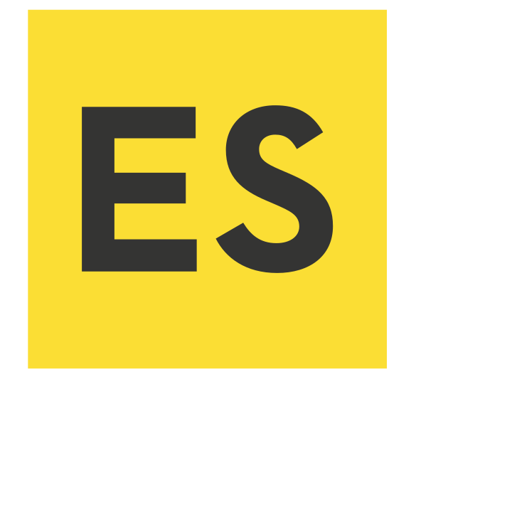

Timeline-for-learning.md

##  Atom <small>(a text editor, written in JavaScript)</small>
   Download and run the installer
   [Debian](https://atom.io/download/deb),
   [RPM](https://atom.io/download/rpm),
   [Mac](https://atom.io/download/osx),
   [Windows](https://atom.io/download/windows)

##  MarkDown <small>(how to create cross platform documents)</small>

[Daring Fireball: Markdown](https://daringfireball.net/projects/markdown/)<br/>
[GitHub's Markdown Tutorial](http://www.markdowntutorial.com/)

In Atom, use the package ***markdown-preview-plus*** instead of the default ***markdown-preview***

##  Git <small>(version control)</small>
 [git - the simple guide](http://rogerdudler.github.io/git-guide/) <br/>
 [Tower's Learn Version Control with Git](https://www.git-tower.com/learn/git/ebook)<br/>
 [Atlassian's Git Tutorial](https://www.atlassian.com/git/)<br/>
 [Good Resources for Learning Git and GitHub](https://help.github.com/articles/good-resources-for-learning-git-and-github/)<br/>
 [Pro-Git](http://git-scm.com/book)

##  Node (and NPM)
   Download and run the installer
   [Pick your OS here](https://nodejs.org/en/download/)

##  JavaScript <small>(ES5 is enough for now)</small>

  write some JavaScript `console.log("Hello World");` <br/>
  run it on your command line `node hello.js`

##  Node Package Manager
   -- mostly you just need `npm install`

##   React
   Just React. The rest comes later.

   ```
   npm install -g create-react-app
cd ~/projects/
create-react-app hello-world
   ```

##  Build a few Things
   (and throw them away)<br/>
   Learn to "think in React" by building many small experiments.

##  Webpack
   ~~Don't skip straight to a boilerplate project~~<br/>
   `create-react-app` generates a very simple webpack.config.js. Start looking there if you are curious.  Leave it alone if you want, you can come back to this later.

##  EcmaScript 6 <small>(aka. EcmaScript 2015)</small>
   Learn the 80% you'll actually use. <br/>
   arrows &bull; let/const &bull; import &bull; classes &bull; destructuring

##  React Router
   React Router doesn't require Redux. <br/>
   Learn it in isolation.

##  Redux
   Start with the official guide: [redux.js.org](redux.js.org)

## 
   Build cross platform desktop apps with JavaScript, HTML, and CSS
